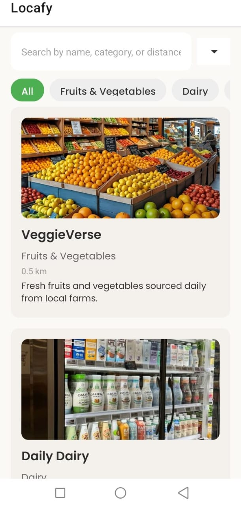
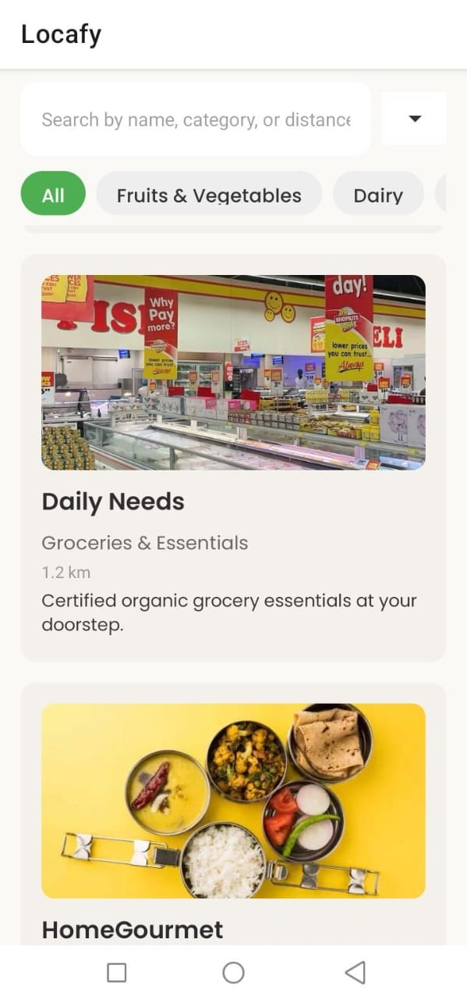
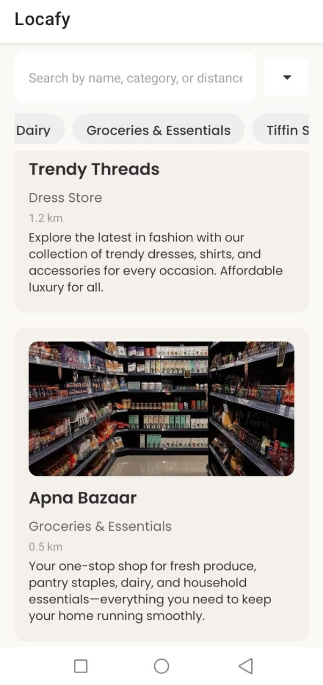
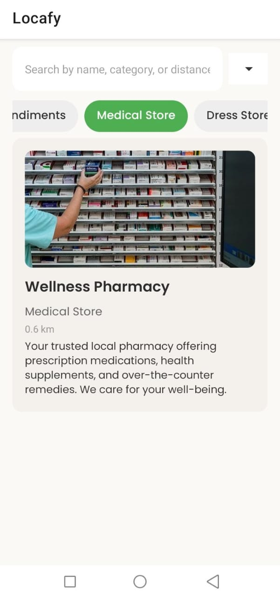
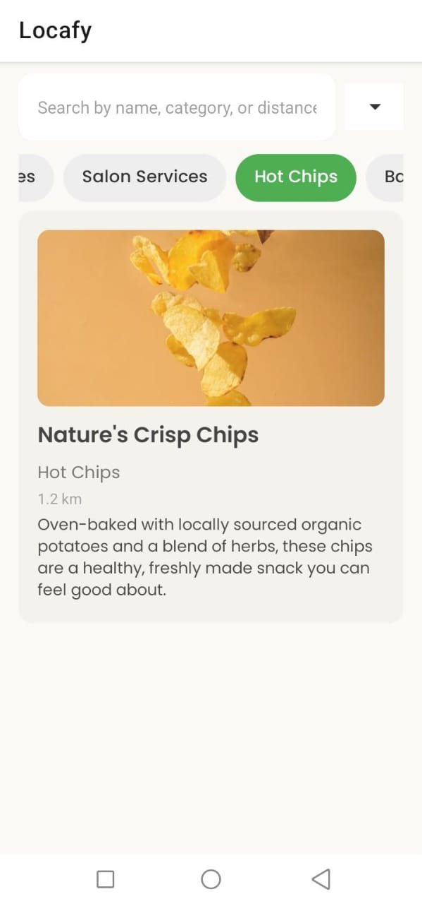
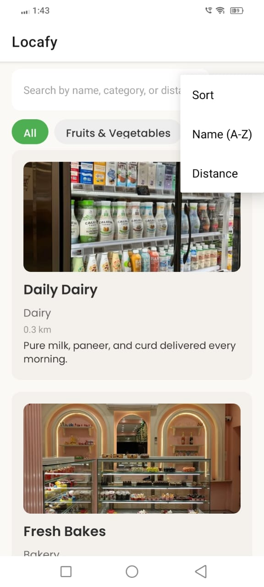
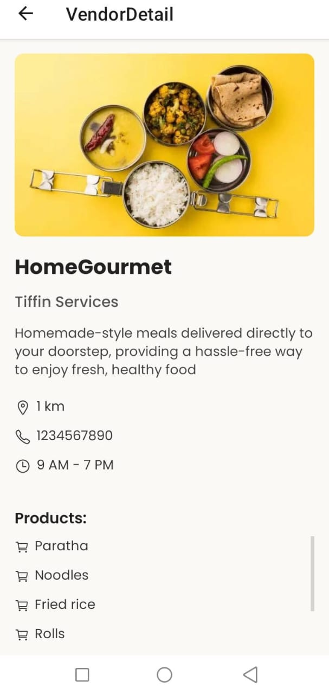
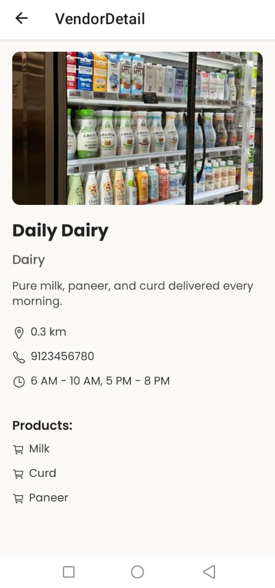

## 🌱 Local Discovery App <br/>
A React Native app built with Expo that helps users discover organic and local vendors in their area — from fruits & veggies to tiffin services and medical stores.

## 📱 Features

- 🔍 Search by name, category, or distance<br/>
- 📂 Filter by vendor category (e.g., Bakery, Dairy, Salon, etc.)<br/>
- 📍 Sort vendors by Name or Distance<br/>
- 🖼️ Vendor image previews<br/>
- 📃 Detailed vendor pages with: Products offered, Distance, Working hours, Contact details<br/>

## 🛠️ Tech Stack

- **React Native** (using Expo)
- **JavaScript (ES6+)**
- **Expo CLI**
- **React Navigation**
- **Poppins Font** (custom font)
- **Ionicons** (icons from Expo vector icons)
- **Git** and **GitHub** (version control)


## ⚙️ How to Run the App
1. Clone the repo
```bash
git clone https://github.com/Soujanyaupase/local-discovery-app.git
cd local-discovery-app
```

2. Install dependencies
```bash
npm install
```

3. Run the app
```bash
npx expo start
```

 ## 📸 Screenshots

### Home Screen
<p>
Screenshot showing filters, search, vendor cards</p>




### Category



### Filter


### Vendor Detail Page
<p> Screenshot showing vendor details, products, distance, contact, working hours</p>




## 💡 Bonus Features

    - Reusable UI cards
    - Dynamic category detection from data
    - Font styling using Poppins
    - Vendor image support
    - Compact sorting dropdown


- **GitHub Repo**: [https://github.com/Soujanyaupase/local-discovery-app](https://github.com/Soujanyaupase/local-discovery-app)
- **Expo Link**: [https://expo.dev/accounts/soujanyaupase/projects/local-discovery-app](https://expo.dev/accounts/soujanyaupase/projects/local-discovery-app)
